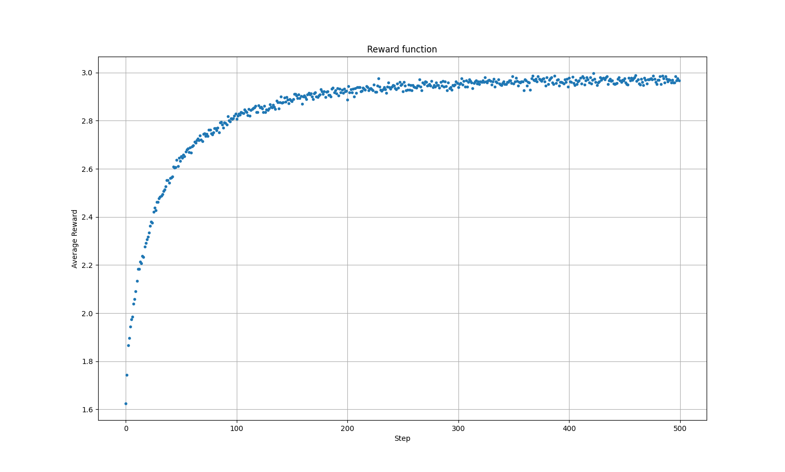
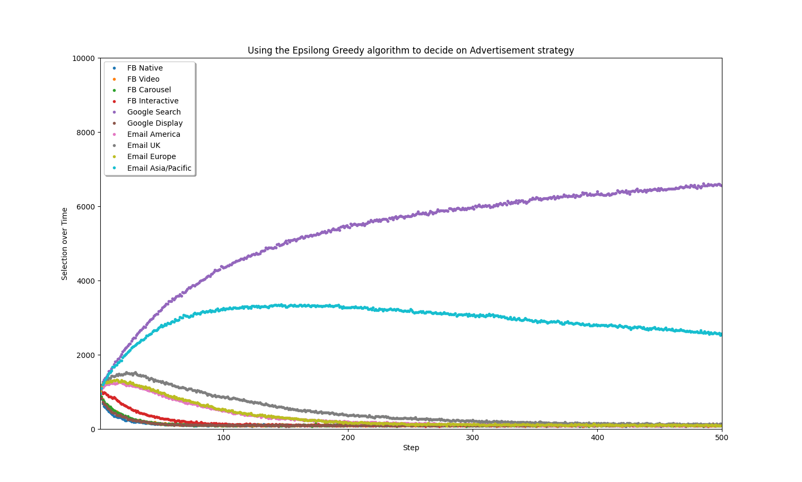

# Exploring Uncertainty Algorithms in the Context of Internet Advertisement

Our project will focus on three areas of internet advertisement: User response, advertisement space, and advertisement competition.

In our project we intend to use three algorithms: Explore and Exploit, Monte Carlo algorithms with advertising strategies similar to options, and Game Theory. 


## User Response

```UserResponse.py```

You don't always have the required information to make the best decision possible. In online advertising there are many different avenues one could take. This part of our project is dedicated to showing that the Epsilon-Greedy algorithm is a viable method of discovering the optimal advertising strategy. The strategies under consideration in our simulation are:

* Facebook
  * Native ads
  * Video ads
  * Carousel ads
  * Interactive ads
* Google
  * Search ads
  * Display ads
* Email
  * North/South America
  * UK
  * Europe
  * Asia/Pacific

Because we don't have access to much real-world data about internet advertising, this is likely due to the competitive nature of advertising, we created mock distributions of the click-through-rates for the different strategies. We created these distributions from an article found at https://agencyanalytics.com/blog/average-click-through-rate.

Click-through rate (CTR) is a metric used in online advertising to measure the ratio of users who click on a specific link to the number of total users who view a page, email, or advertisement.

### Requirements

To run ```UserResponse.py``` you will need the following:

* numpy
* matplotlib
* ``ExploreAndExploit.py``

### Output
Here is the reward function: 

Here is the simulations graph: 

## Advertising Space

```AdvertisingSpace.py```

Description of why.

We believe that a monte carlo algorithm similar to stock options can be utilized to solve the problem of advertising space pricing.

To run ```AdvertisingSpace.py``` you will need the following:

* Insert required libraries here


## Advertisement Competition

```AdvertisementCompetitors.py```

Description of why.

Game theory algorithms will be implemented for simulation of this side of iternet advertisement.

To run ```AdvertisementCompetitors.py``` you will need the following:

* Insert required libraries here